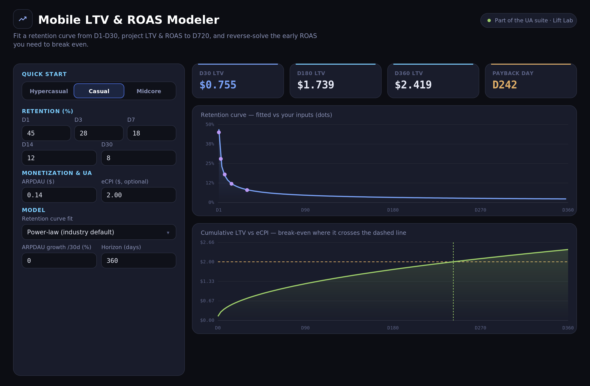
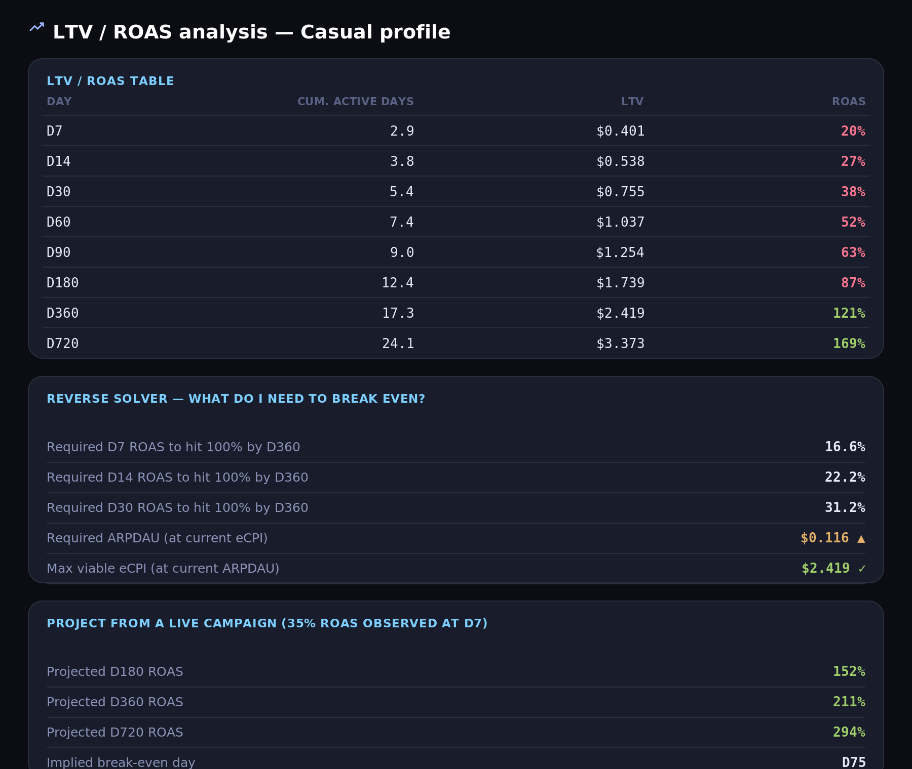

# 📈 Mobile LTV & ROAS Modeler

[](https://stonedhawk.github.io/mobile-ltv-roas-modeler/)

[](LICENSE)
[](#)
[](#)

**A dependency-free, single-file LTV & ROAS modeler for mobile game UA.** Drop in your D1-D30 retention. It fits the curve, projects LTV and ROAS out to D720, tells you the day you pay back, and works backwards to the early ROAS you actually need to break even. It runs entirely in the browser. No SDK, no backend, nothing leaves the page.

### ▶ Try it live: **[stonedhawk.github.io/mobile-ltv-roas-modeler](https://stonedhawk.github.io/mobile-ltv-roas-modeler/)**



---

## 🎯 What it answers

- **What's my D30 / D180 / D360 / D720 LTV** at this retention and ARPDAU?
- **When does this cohort pay back** at a given eCPI?
- **What D7 / D14 ROAS do I need** to hit 100% ROAS by D180, D360, or D720? That's the reverse solver, and it's the part most spreadsheets skip.
- **Where is a live campaign actually heading?** Feed it an observed D7 ROAS and it projects the mature number.
- **What's the most I can pay per install**, or the ARPDAU I'd need, to make the target work?



---

## 🚦 Quick-start profiles

One click loads a realistic starting point so you're not staring at a blank form:

| Profile | Retention shape | ARPDAU | eCPI | Payback |
|---------|-----------------|--------|------|---------|
| **Hypercasual** | D1 38% to D30 2.5% | $0.06 | $0.30 | ~D177 |
| **Casual** | D1 45% to D30 8% | $0.14 | $2.00 | ~D242 |
| **Midcore** | D1 50% to D30 14% | $0.40 | $7.50 | ~D122 |

---

## 🧮 How the model works

| Step | Formula |
|------|---------|
| **Retention fit** | Least-squares on D1/D3/D7/D14/D30, plus an optional long-horizon anchor. Power-law `R(d)=A·d^b`, exponential `R(d)=A·e^(b·d)`, or a blend. Day 0 = 1.0. |
| **Active days** | `ActiveDays(N) = 1 + Σ R(d)` for d = 1…N |
| **LTV** | `LTV(N) = Σ ARPDAU(d)·R(d)`, with `ARPDAU(d) = ARPDAU₀·(1+g)^(d/30)` |
| **ROAS** | `ROAS(N) = LTV(N) / eCPI × 100%`; payback is the first day LTV ≥ eCPI |
| **Reverse solver** | Required ROAS at day E for target T% by day H: `T × LTV(E)/LTV(H)` |
| **Campaign projection** | `ROAS(Y) = ROAS_obs × LTV(Y)/LTV(X)` |

---

## ⚠️ The honest caveat

With no long-horizon anchor, the curve is fit on 30 days of data or less, so D360 and D720 are pure extrapolation. Two things bite you in reality:

1. **Long-tail retention flattens.** A pure power-law tends to *under*-count the survivors who stick around for months.
2. **ARPDAU drifts up** as low-value users churn and the payers concentrate.

So keep it honest. Drop a real D60, D90, or D180 retention point into the *Long-horizon anchor* field to pin the tail, use the **ARPDAU growth** input, and read far-horizon numbers as a band, not a single point. The tool flags you the moment you're projecting past your anchored data.

---

## 🚀 Run it

Use the **[hosted version](https://stonedhawk.github.io/mobile-ltv-roas-modeler/)**, or run it locally. It's one file, no build step:

```bash
git clone https://github.com/stonedhawk/mobile-ltv-roas-modeler.git
open mobile-ltv-roas-modeler/index.html
```

---

## 📄 License

[MIT](LICENSE). Use it inside your studio or fork it freely.

---

Built by [Rahul Shah](https://github.com/stonedhawk). 16 years producing mobile games by day, packaging producer problems into tools by night.
